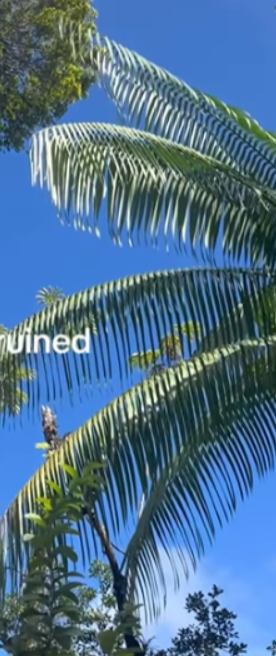
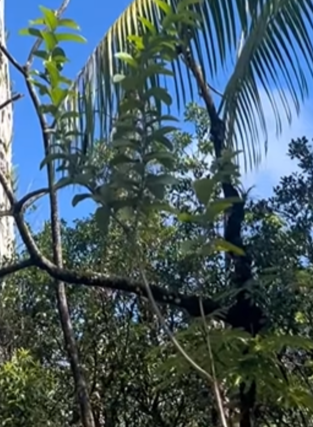
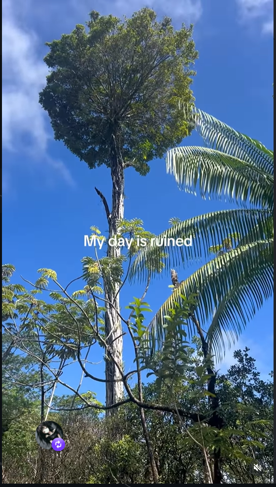
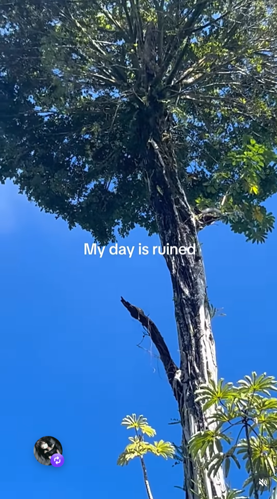
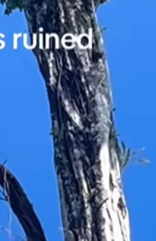
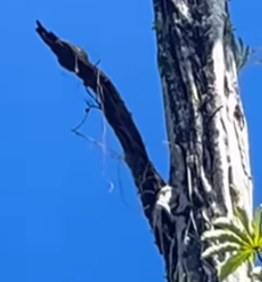
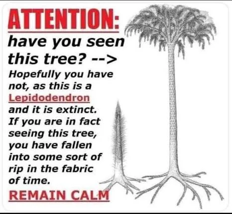
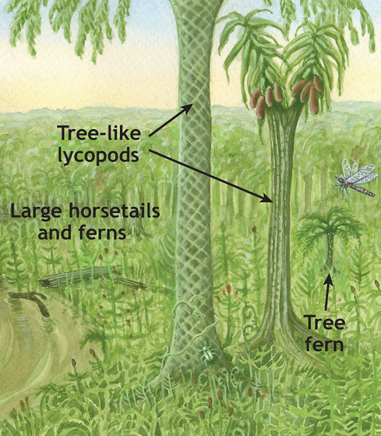

## Finding the Location

Okkkk so let's get this started. This was posted under the username @junglefairyfarm, so I clicked on the profile and yup, she DOEs have a farm. It pretty much looks like it from the fern, tropical, and lots of mixed banana and coconut trees. It MUST BE a tropical place.

And then I looked at the bio, there's this like:

"...Off-grid in the jungle on a volcano 🌋 ......."

"JUNGLE ON A VOLCANO"

## Environmental Clues

There's one tropical island that has owned this title, it is no other than Hawaii—MOST probably Kauai island. And then the second hint is footage of the reel.

This is definitely a tropical palm species

and this is more likely a trumpet or guava tree. And the sky says it all. So count one: tropical island locked.

<b>Now let's analyze the elephant in the room. </b>

 

## Analyzing the Tree
 

So I was almost gonna think its a WELL urban legend, more likely a tropical legend, CAUSE it looks like it SHOULDNT exist.

### The trunk
 
The main tree, aka the scale tree. What caught my eyes was...... wait.....it almost looks like two distinct colors in the trunk. The CORE trunk.....its way too much dark... and the unrealistically thick vines around it- its.....unbelievably light colored, and ofc its not because of any light theory.

It was almost like I was looking into a banyan- .....and right there everything clicked- the tree....we're seeing is DEAD....all alone. The proof is....

 

This image right here. You see the main tree/what we're thinking as the scale tree, now rather I wanna call it the host tree. Look how the branch is DEAD- the like little thin vine on it....its also DEAD.

## Final Verdict
 
this is the actual internet creepypasta/legend

### Wiki

 
And so I did what I was supposed to do, read the wiki of their whole genus and family. What I found was... only two had branched: Diaphorodendron and Synchysidendron. But the lepidodendron was supposed to be a lollipop.

Ok then the question is what on earth are we seeing in this clip?

## Conclusion:

The main tall scaly vibe giving is a rather normal tree

The massive vine we're seeing is one of those Epiphyte who got buffed because of tropical nature

However this is SUCH a convincing and rare phenomenon !!
